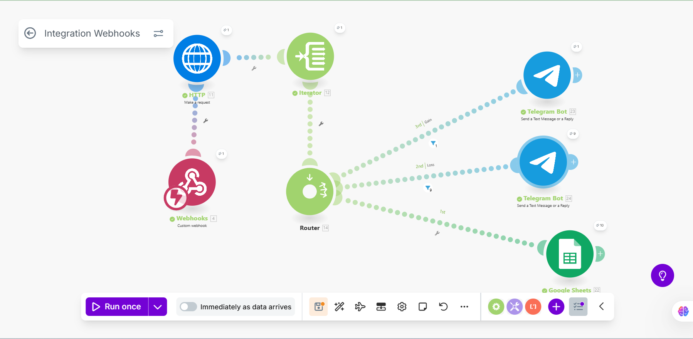

<!--Section 1: Introduce your self-->
## ABOUT ME

Hello! I'm Sakiru Akinpelu 🤖, a data analyst and automation engineer passionate about helping businesses work smarter through data-driven automation. With hands-on experience in data analysis, workflow automation, and process optimization, I specialize in transforming repetitive manual tasks into efficient, scalable systems.

By combining analytics with automation tools, I help organizations uncover insights, improve accuracy, and save valuable time—turning everyday processes into opportunities for growth and innovation.

<!--Mention your top/relevant skills here - core and soft skills-->
## WHAT I DO

- Process Automation & Optimization.
I design and implement automated workflows that eliminate repetitive tasks, reduce errors, and improve efficiency—helping teams focus on what truly matters.

- Data Analytics & Insights.
I analyze business data to uncover trends, track performance, and generate actionable insights that support smarter decision-making and sustainable growth.

- Dashboard Development.
I build interactive dashboards and reports that visualize key metrics, enabling teams to monitor operations and measure impact in real time.

- Training & Knowledge Sharing.
I provide hands-on training sessions and resources on data analysis, Excel automation, and process improvement to empower professionals and organizations.

<!--Section 2: List 3-4 key projects-->
## MY Automations 

*A glimpse of some of the projects I've been working on.*

**Crypto Price Alert System (CoinGecko → Google Sheets → Telegram Bot)**

This automation is designed to monitor live cryptocurrency prices using data from the CoinGecko API, log them into Google Sheets, and automatically send price alerts to Telegram based on real-time market changes.

[Read More](https://mercy-williams-porfolio.my.canva.site/dark-and-playful-simple-creative-portfolio-presentation)

**Predictive Modeling and Hypothesis Testing using Titanic Dataset.**

On April 15, 1912, during her maiden voyage, the widely considered “unsinkable” RMS Titanic sank after colliding with an iceberg. 

[Read More](https://www.linkedin.com/pulse/predictive-modeling-hypothesis-testing-using-titanic-dataset-anietie/)

**Predictive Modeling and Hypothesis Testing using Titanic Dataset.**

Unfortunately, there weren’t enough lifeboats for everyone onboard, resulting in the death of 1502 out of 2224 passengers and crew. 

<a href="17 How to Present Data to Executives by Anietie Etuk.pdf">Download the Report here (pdf file)</a>

## CONTACT DETAILS

*Let’s connect and see how we can make a difference together!*
<table>
  <tbody>
    <tr>
      <td>📧</td>
      <td><a href="mailto:sakiruakinpelu1@gmail.com">sakiruakinpelu1@gmail.com</a></td>
    </tr>
    <tr>
      <td>📞</td>
      <td>(234) 808-012-6735</td>
    </tr>
    <tr>
      <td>📍</td>
      <td>Abuja, Nigeria</td>
    </tr>
    <tr>
      <td>⬇️</td>
      <td><a href="https://etuk123456.github.io/portfolio1/docs/Profile.pdf">Download my CV</a></td>
    </tr>
    <tr>
      <td>🌐</td>
      <td><a href="https://www.linkedin.com/in/sakiruakinpelu/">The things I do daily on LinkedIn</a></td>
    </tr>
  </tbody>
</table>

   

